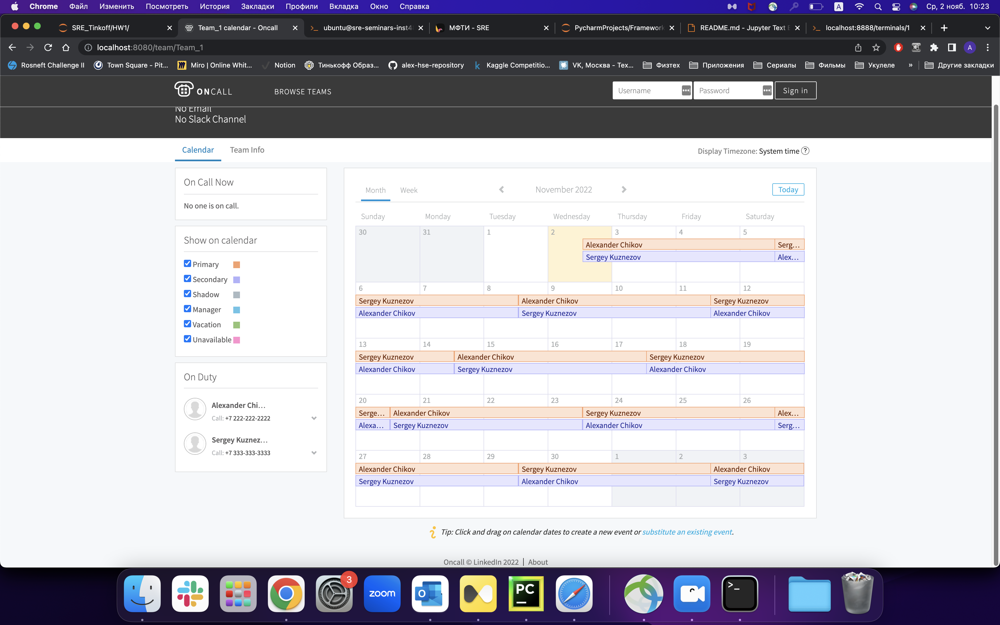

# ДЗ-1
## Здание 1: Установить Oncall

На машине запущен сервис Oncall, для подключения к UI:
```bash
ssh -L 8080:127.0.0.1:8080 ubuntu@130.193.50.69
```
На `localhost:8080` появится UI Oncall.

## Задание 2: Создать тестовых пользователей, больше 3

Для создания пользователей используется скрипт `create_users.py`

```bash
./create_users.py
```

Скрипт выводит список текущих пользователей по завершению, можно получить список самостоятельно:
```bash
curl http://localhost:8080/api/v0/users | json_pp
```

## Задание 3: Завести 2-3 команды, больше 1

Для создания команд использовался UI, список текущих команд:
```bash
curl http://localhost:8080/api/v0/teams | json_pp
curl http://localhost:8080/api/v0/teams/Team_1 | json_pp
curl http://localhost:8080/api/v0/teams/Team_2 | json_pp
```

## Задание 4: Заполнить расписание дежурств на 2 месяца вперед

Для создания расписания используется скрипт `create_schedule.py`. В скрипте реализован вариант "Пересменка каждые 3 дня в 10 часов утра".
```bash
./create_schedule.py
```

Заполненое расписание можно посмотреть в UI

