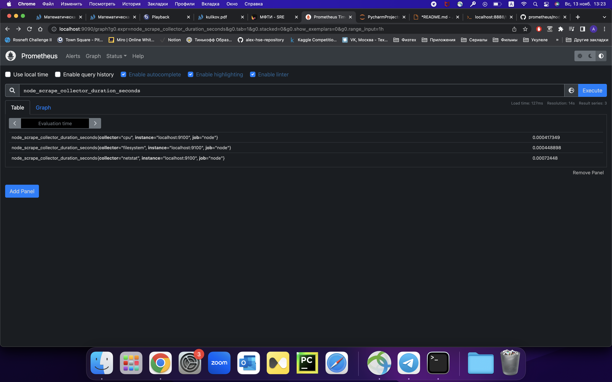

# ДЗ-3
## Здание 1: Установить Node-Exporter и добавить его в Prometheus.

Для установки были проделаны все шаги из инструкции к семинару.
На машине запущен сервис Prometheus, для подключения к UI:
```bash
ssh -L 9090:127.0.0.1:9090 ubuntu@130.193.50.69
```
На `localhost:9100` появится Node-Exporter.


В сервисах Prometheus появится новый сервис Node


## Задание 2: Отключить коллекторы, которые не используются
Для запуска сервиса только с необходимыми коллекторами добавим необходимые флаги к команде запуска в `/lib/systemd/system/node_exporter.service`:
```bash
[Service]
ExecStart=/usr/local/bin/node_exporter --web.listen-address=0.0.0.0:9100 --collector.textfile.directory=/opt/prometheus_exporters/textfile
```
Таким образом были отключены все дефолтные коллекторы и включены cpu, filesystem, netstat. Список включенны коллекторов можно увидеть в результатах запроса PromQL:



## Задание 3: Сделать простой скрипт для Textfile-collector по любой метрике, которая отсуствует в node-exporter, обносновать почему вы решили ее использовать.
